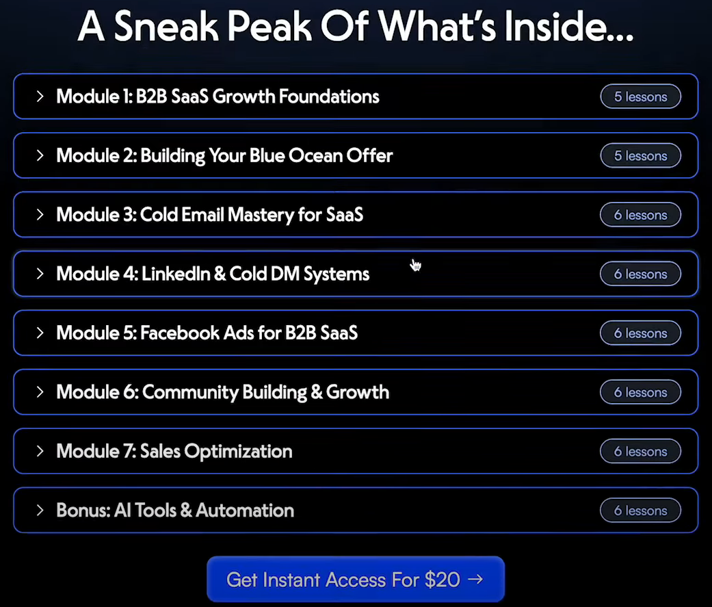
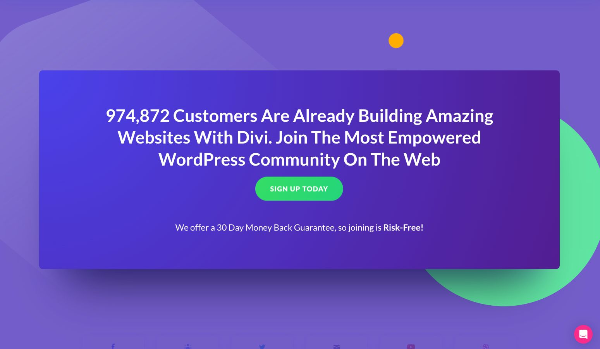
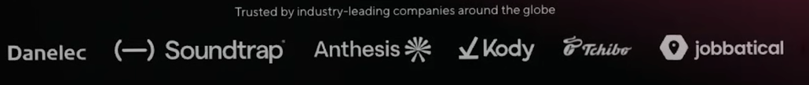

# Blocos Sessões Landing Page for SaaS

Criado em: 5 de maio de 2025 23:45
Atualizado: 24 de novembro de 2025 14:12
Framework: Landing Page
Status: Em andamento

# 1º DOBRA

## 1. Banner de Aviso

- Texto

## **2. Seção de destaque (hero section)**

- Logomarca
- **Eyebrow Text:** Coloque esse texto acima do headline e chame a atenção do público-alvo ou faça uma pergunta que se relacione com seu ICP (Perfil de Cliente Ideal). Exemplo: “Para fundadores iniciantes, coaches e consultores” ou “Com dificuldades para se tornar lucrativo?”
- **Headline (Título Principal):** Esse é o primeiro texto que seu prospecto verá ao entrar na página. Ele deve prometer um resultado dos sonhos ou fazer uma pergunta atraente, como “Ganhe seus primeiros $1.000 online”. O headline é crucial e deve receber 80% do seu esforço.
- **Subtítulo (Sub-Headline):** Expanda a ideia do headline em no máximo 3 frases.
- Bullets de Benefícios: São usados para responder ou neutralizar objeções comuns que o público possa ter antes de tomar uma ação.
- **Botão de CTA (Call to Action):** O botão deve ser destacado e descritivo. Mantenha-o simples.
- **Prova Social (Social Proof):** Mostre 3 a 5 fotos de clientes e destaque o número total de clientes que você já atendeu. Exemplo: “Junte-se a mais de 100 alunos”.

## **3. Demonstrativo interativo ou visual do produto (Vídeo)**

- **Vídeo de Vendas (Video Sales Letter):** Exatamente o que parece – uma carta de vendas gravada em formato de vídeo.
- 06 Bullet Points benefícios

# ABAIXO DA 1º DOBRA

## 3. Depoimentos

- Título
- Depoimentos em WhatsApp
- CTA

## 4. Problemas

- **Headline:** Aborde o problema em uma ou duas frases, como “O problema com a maioria das agências...”.
- Ampliação do Problema 1
- Ampliação do Problema 2
- Ampliação do Problema 3
- Ampliação do Problema 4
- Botão de CTA

## 3. **Mecanismo de falsa solução**

- Introduza soluções para os problemas apresentados anteriormente, mas sem mencionar seu produto/serviço específico ainda.
- Solução 1
- Solução 2
- Solução 3
- Botão de CTA

## 3. Introduzir o produto

O objetivo aqui é fazer com que entendam como o seu produto pode tirá-los da situação dolorosa.

- Entregável 1 com breve descrição
- Entregável 2 com breve descrição
- Entregável 3 com breve descrição
- Entregável 4 com breve descrição
- CTA

## 3. Benefícios

Use esta seção para aprofundar na solução que seu produto oferece.

- Entrega 1 com breve descrição
- Entrega 2 com breve descrição
- Entrega 3 com breve descrição
- Entrega 4 com breve descrição
- Botão de CTA

## 3. Qualificação

- Título
- **Subtítulo**

- Título
- Bullet point
- Bullet point

- Título
- Bullet point
- Bullet point
- CTA

## Empilhamento de Oferta/Valor (Offer/Value Stacking)

- Título
- Depoimentos em WhatsApp
- CTA

## 3. Vídeos Depoimentos com Headline

- Título
- Depoimentos em WhatsApp
- CTA

## 3. Manifesto

- Título
- Depoimentos em WhatsApp
- CTA

## 3. Perguntas Frequentes

- Título
- Depoimentos em WhatsApp
- CTA

## 3. Painel de Chamada para Ação "Too Long Didn't Read" (TL;DR)

- Título
- Depoimentos em WhatsApp
- CTA

## 3. Rodapé

- Título
- Depoimentos em WhatsApp
- CTA

## 3. Aviso Legal

- Título
- Depoimentos em WhatsApp
- CTA

## 3. Tabela de Comparação

- Título
- Depoimentos em WhatsApp
- CTA

## 3. Depoimentos

- Título
- Depoimentos em WhatsApp
- CTA

## 3. Depoimentos

- Título
- Depoimentos em WhatsApp
- CTA

---

## Adicionais

### Notificações de Prova Social em Tempo Real

<aside>
📝

Adicione notificações de prova social em tempo real, como pop-ups que mostram o que outras pessoas estão fazendo no seu site, seja se inscrevendo, comprando ou baixando algo. Ferramentas como UseProof facilitam isso. Essas notificações criam uma sensação de urgência e medo de ficar de fora, aumentando as conversões em até 10-15%.

</aside>

## Elementos

### Usar Prova Social Acima da Dobra

<aside>
📝

Utilize o topo da sua landing page para mostrar provas sociais e construir confiança imediatamente. Inclua fotos de clientes reais, gráficos de estrelas, depoimentos impactantes ou números como "confiado por milhares". Empresas B2B podem destacar logotipos de clientes ou de mídia reconhecidos para aumentar a credibilidade.

</aside>

---

### Notificações de Prova Social em Tempo Real

<aside>
📝

Adicione notificações de prova social em tempo real, como pop-ups que mostram o que outras pessoas estão fazendo no seu site, seja se inscrevendo, comprando ou baixando algo. Ferramentas como UseProof facilitam isso. Essas notificações criam uma sensação de urgência e medo de ficar de fora, aumentando as conversões em até 10-15%.

</aside>

---

### Copy Sobrancelha

<aside>
📝

É uma pequena linha de texto acima do título principal que cria contexto imediato, engaja o visitante e ajuda a capturar atenção. Ela deve ser curta, direta e complementar o título, indicando o benefício principal ou para quem a página é destinada. Exemplos: "Transforme sua carreira agora" ou "Controle total das suas finanças". É poderosa porque reduz dúvidas, orienta o leitor rapidamente e aumenta as chances de conversão.

</aside>

---

### Vídeos Depoimentos com Headline

<aside>
📝

Incluir um **headline resumido e impactante** logo acima ou ao lado do vídeo. Isso garante que, mesmo que o visitante não assista ao vídeo, ele capture a mensagem principal.

Por exemplo, destaque uma frase-chave do depoimento, como: *"Economizei 10 horas por semana com este serviço!"*. Isso transmite o valor do vídeo instantaneamente e aumenta a efetividade da prova social.

</aside>

---

### Tabela de Comparação

<aside>
📝

Crie uma tabela de comparação que mostre claramente por que seu serviço é a melhor escolha em relação às opções concorrentes. Foque em destacar seus diferenciais sem depreciar a concorrência. Mostre onde você se destaca, como oferecer estratégias personalizadas versus métodos genéricos, facilitando a decisão do visitante ao evidenciar os benefícios de escolher você.

</aside>

---

### Tabela de Subistituição

<aside>
📝

</aside>

---

### Benefícios, Não nas Características

<aside>
📝

Em vez de listar as características técnicas do seu produto ou serviço, destaque os benefícios que realmente importam para o cliente. Por exemplo, ao invés de dizer "nosso alimento contém espinafre fresco", diga "melhora a digestão e a energia do seu cão". Isso cria uma conexão emocional e mostra como seu produto pode melhorar a vida do cliente.

</aside>

---

### Painel de Chamada para Ação "Too Long Didn't Read" (TL;DR)

<aside>
📝

Alguns visitantes irão direto para o final da página em busca de informações específicas ou do preço, ignorando os detalhes e benefícios. Adicione um painel de chamada para ação no final da página que resuma os pontos-chave e reforce a oferta principal. Isso ajuda a converter visitantes que preferem um resumo rápido sem sobrecarregá-los com informações adicionais.

</aside>

---

### Otimização do Botão de Chamada para Ação (CTA)

<aside>
📝

Incentive os visitantes a clicarem no botão de CTA adicionando uma pequena linha de apoio, como "Configuração em 5 minutos" ou "Sem cartão de crédito necessário". Isso reduz a hesitação e torna a ação mais segura e fácil, aumentando a probabilidade de conversão.

</aside>

---

### Qualificação

<aside>
📝

A **seção de qualificação** tem o objetivo de identificar o público ideal para sua oferta, aumentando conversões e otimizando recursos ao evitar leads inadequados. Essa etapa constrói confiança ao direcionar o produto para quem realmente precisa dele.

</aside>

---

### História pessoal

<aside>
📝

**História Pessoal**

Esta seção fortalece a confiança e constrói mais autoridade ao usar uma história pessoal.

Ela também ajuda pessoas que não assistiram ao VSL (Vídeo de Vendas) a entender quem você é e por que você é confiável. Para aqueles que assistiram ao VSL, normalmente adicionamos outro argumento de vendas aqui.

---

**Resumo Explicativo:**

A ideia dessa seção é **construir credibilidade e conexão emocional** com o público, especialmente para aqueles que ainda não conhecem sua trajetória (não assistiram ao VSL). Se a pessoa já assistiu ao VSL, você pode reforçar a confiança com um argumento de vendas extra.

Se substituir por um manifesto, o foco será mais em transmitir sua visão e valores, sem perder o objetivo de gerar confiança e autoridade.

</aside>

---

### Alavancagem de Preço

<aside>
📝

</aside>

---

### [**Mecanismo de falsa solução**](https://www.notion.so/Mecanismo-de-falsa-solu-o-1eb15041ac088128b2e0c9588e4f088c?pvs=21)

<aside>
📝

O **mecanismo de falsa solução** é uma estratégia usada no marketing e copywriting para destacar que as soluções convencionais ou alternativas disponíveis no mercado (oferecidas por concorrentes, por exemplo) são ineficazes, incompletas ou incapazes de resolver plenamente o problema do público-alvo.

</aside>

---

### Proof Stacking

<aside>
📝

**Proof Stacking** é uma estratégia de marketing que consiste em **empilhar ou agrupar múltiplas provas sociais e evidências de credibilidade** em um único lugar ou sequência, para convencer o público sobre a qualidade, confiabilidade ou eficácia de um produto ou serviço.

### O que pode ser incluído no **Proof Stacking**:

1. **Depoimentos de clientes**: Declarações reais de pessoas satisfeitas que usaram o produto/serviço.
2. **Avaliações de 5 estrelas**: Exibição de classificações de plataformas como Google, Trustpilot, etc.
3. **Números impressionantes**: Estatísticas como “+100.000 usuários satisfeitos” ou “4,9/5 de avaliação”.
4. **Certificações ou Selos**: Garantias de segurança, prêmios ou reconhecimentos.
5. **Parcerias ou logotipos de grandes empresas**: Mostrar clientes ou parceiros confiáveis que utilizam o serviço.
6. **Estudos de caso**: Relatos detalhados de como o produto ajudou um cliente específico.

### Objetivo do **Proof Stacking**:

O objetivo é reforçar a confiança do público, utilizando várias camadas de evidências para eliminar objeções e reduzir o risco percebido na tomada de decisão. Essa técnica é especialmente eficaz em páginas de vendas e landing pages.

### Exemplo de uso:

Em uma página de vendas, logo abaixo do título, você pode ter:

- Depoimentos em vídeo.
- Avaliações com estrelas.
- Logotipos de empresas famosas que usam o serviço.
- Um selo de segurança, como "Garantia de reembolso em 30 dias".

Esse empilhamento cria uma narrativa clara de confiança, credibilidade e sucesso.

</aside>

---

### Título

<aside>
📝

</aside>

---

## Vídeos

[9 Landing Page Hacks To Get More Leads INSTANTLY](https://youtu.be/mGbLhEY7nPE?si=bFjkaNgOAtxvEkRm)

[SaaS Competitor Comparison Pages: Why you NEED to Build them](https://youtu.be/DXrqf5Xqpd4?si=ZG4YO0645OR9Ssjl)

[Copy This Perfect Landing Page To Double Your Leads Instantly](https://youtu.be/V2_LNtV95jM?si=i_DcvcP6deHtoQVs)

[Steal My $5,000,000 Landing Page Framework](https://youtu.be/GVeiQILeVPc?si=G70kFwHsbiJE6sS-)

[Steal This $3M Info Product Landing Page Framework](https://youtu.be/Yu8fHxNVKu8?si=7QNvHOson53RY-u8)

[How Russell Brunson Built $265M Landing Page (Linchpin)](https://youtu.be/HtCW-IIbgoo?si=KT-sRdRK9QE2-JNF)

[Perfect Homepage Design Explained (in 15 minutes)](https://youtu.be/iTbyMPgV2aw?si=dXrTBgKY1cWOm0nd)

[9 Keys to a Perfect SaaS Website](https://youtu.be/hPtyEDZtPHA?si=uMPqXHg6sfzekeh_)

---

## Sites para Inspirações

https://groove.cm/

https://www.woodburnwealthgroup.com/

---

## Argumento Incontestável

Um argumento incontestável combina lógica e emoção de forma tão eficaz que o "óbvio" é concordar com ele. Ele precisa se ancorar em pilares de credibilidade, como: um fato real (notícia, acontecimento histórico, vivencia pessoal), um dado de fonte confiável (estudos, pesquisas, artigos) ou uma premissa de senso comum muito forte.

---

## Com o Saas e Sem o Saas

